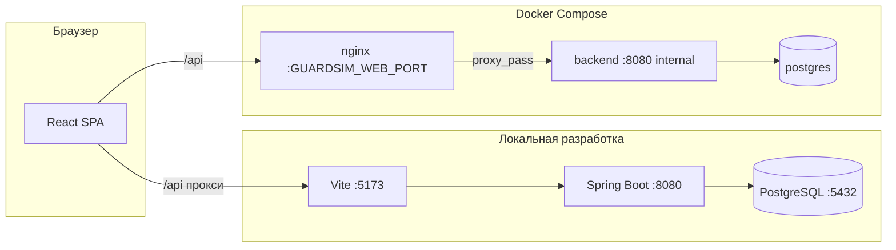

# GuardSim (КиберСтоп)

**GuardSim** — веб-приложение для обучения основам защиты персональных данных и распознавания типовых киберугроз. Игрок проходит интерактивные сценарии (фишинг, соцсети, звонки «банка», поиск в выдаче, мини-игры в духе SOC) и накапливает репутацию, опыт и достижения.

Проект состоит из **SPA на React** (Vite, TypeScript, Sass) и **REST API на Kotlin / Spring Boot 3** с **PostgreSQL**. Аутентификация — **JWT (HS256)**; для гостевого режима используются отдельные HTTP-заголовки.

---

## Содержание

- [Возможности](#возможности)
- [Архитектура](#архитектура) 
- [Требования](#требования)
- [Быстрый старт (локальная разработка)](#быстрый-старт-локальная-разработка)
- [Запуск через Docker Compose](#запуск-через-docker-compose)
- [Конфигурация и секреты](#конфигурация-и-секреты)
- [HTTP API и Swagger](#http-api-и-swagger)
- [Маршруты фронтенда](#маршруты-фронтенда)
- [Идентификация клиента (заголовки)](#идентификация-клиента-заголовки)
- [Сборка production](#сборка-production)
- [Тесты](#тесты)
- [Структура репозитория](#структура-репозитория)
- [Устранение неполадок](#устранение-неполадок)

---

## Возможности

- **Каталог сценариев** — тематические цепочки (почта, соцсети, ИБ, бытовые мошенничества, вредоносы, поиск и периметр и др.) с пошаговой симуляцией интерфейсов (письма, чаты, календарь, расширения, VirusTotal, Net Shield, звонок/SMS и т.д.).
- **Сессии и прогресс** — сохранение незавершённых сценариев, подсчёт баллов, объяснения после ответов, учёт «идеальных» прохождений и серий.
- **Ограничение по времени на шаг** — для отдельных шагов при истечении таймера шаг засчитывается как провал **без начисления баллов** за этот шаг.
- **Челлендж-дорожки** — визуальные треки с группировкой сценариев по темам.
- **Профиль и награды** — репутация, уровни по XP, достижения с индивидуальными значками, недельная цель.
- **SOC Defender** — аркадный режим защиты периметра с локальной статистикой в браузере.
- **Виртуальный рабочий стол «антивирус»** — мини-сценарии с разными типами «вирусов» и задачами.
- **Регистрация и вход** или **демо без аккаунта** (гостевой прогресс с флагом демо и локальным `playerId`).
- **Адаптивная вёрстка** — поддержка узких экранов, safe-area, альбомной ориентации.

Подробное описание полей API и схем запросов/ответов доступно в **Swagger UI** (см. ниже) при запуске бэкенда напрямую на хосте.

---

## Архитектура



- **Локально:** Vite проксирует запросы с префиксом `/api` на `http://127.0.0.1:8080` (см. `frontend/vite.config.ts`).
- **Docker:** контейнер `web` (nginx) отдаёт статику фронтенда и проксирует только путь **`/api`** на сервис `backend`. База — отдельный контейнер `postgres`.

---

## Требования

| Компонент | Версия / примечание |
|-----------|---------------------|
| **JDK** | 17 (Temurin и аналоги) |
| **Maven** | 3.9+ |
| **Node.js** | 20+ (в Docker-образе фронта используется 22) |
| **PostgreSQL** | 16+ (локально или через Compose) |
| **Docker** | опционально, для Compose-сборки |

---

## Быстрый старт (локальная разработка)

### 1. Клонирование и зависимости

```bash
git clone <url-репозитория> guardSim
cd guardSim
make install
```

`make install` выполняет `mvn compile` в `backend/` и `npm install` в `frontend/`.

### 2. База данных

По умолчанию бэкенд ожидает PostgreSQL:

- **URL:** `jdbc:postgresql://127.0.0.1:5432/guardsim`
- **Пользователь / пароль:** `guardsim` / `guardsim` (см. `backend/src/main/resources/application.properties`)

Создайте БД и пользователя или поднимите только Postgres через Compose:

```bash
docker compose up -d postgres
```

(потребуется файл `.env` с `POSTGRES_PASSWORD`; см. раздел про Docker).

### 3. Запуск API и фронтенда одной командой

```bash
make dev
```

Скрипт:

1. пытается освободить порт **8080** (`make free-port`);
2. стартует **Spring Boot** на `:8080`;
3. ждёт готовности `GET /api/scenarios` (с тестовыми заголовками демо);
4. запускает **Vite** (порт смотрите в логе, обычно **5173**).

Откройте в браузере адрес Vite (например `http://localhost:5173`).

### Отдельные процессы

```bash
make backend    # только API :8080
make frontend   # только Vite (прокси /api → 8080)
```

### Полезные цели Makefile

| Цель | Назначение |
|------|------------|
| `make help` | Краткая справка по целям |
| `make build` | JAR бэкенда + production-сборка фронта |
| `make clean` | `mvn clean` и удаление `frontend/dist` |
| `make free-port` | Освободить TCP 8080 (macOS/Linux, `lsof` + `kill`) |

---

## Запуск через Docker Compose

Стек: **PostgreSQL → Spring Boot → nginx** (статика + прокси `/api`).

### 1. Переменные окружения

```bash
cp .env.example .env
```

Заполните **обязательные** значения:

- **`GUARDSIM_JWT_SECRET`** — секрет HMAC для JWT, **не короче ~32 символов** UTF-8.
- **`POSTGRES_PASSWORD`** — пароль роли `guardsim` и БД `guardsim`. Если в пароле есть символ `$`, в `.env` для Compose экранируйте как `$$`.

Опционально:

- **`GUARDSIM_WEB_PORT`** — порт на хосте для веб-интерфейса (по умолчанию **8080**). Контейнер `web` слушает 80 внутри сети Compose.

### 2. Сборка и старт

```bash
docker compose up --build
```

Откройте `http://localhost:<GUARDSIM_WEB_PORT>` (часто `http://localhost:8080`).

### 3. Диагностика Postgres

Если контейнер `postgres` сразу завершается с кодом 1:

```bash
make docker-logs-postgres
```

Часто помогает сброс тома (данные БД будут удалены):

```bash
make docker-reset-volumes
docker compose up --build
```

### Swagger UI в Docker

Сервис `backend` в Compose **не публикует** порт 8080 на хост — снаружи доступен только nginx (`web`) с маршрутом **`/api`**. Эндпоинты **`/swagger-ui.html`** и **`/v3/api-docs`** идут **не** под префикс `/api`, поэтому **по умолчанию Swagger с хоста в Docker-стеке недоступен**.

Варианты:

- временно добавить в `docker-compose.yml` у `backend` секцию `ports: "8081:8080"` и открывать Swagger на `http://localhost:8081/swagger-ui.html`;
- или дополнить `frontend/nginx.conf` отдельными `location` для проксирования `/swagger-ui` и `/v3/api-docs` на `backend:8080`.

При **локальном** `mvn spring-boot:run` Swagger доступен на `http://localhost:8080` (см. ниже).

---

## Конфигурация и секреты

### Бэкенд (`application.properties` и переменные среды)

| Параметр | Назначение |
|----------|------------|
| `server.port` | Порт HTTP (по умолчанию **8080**) |
| `SPRING_DATASOURCE_URL` | JDBC URL PostgreSQL |
| `SPRING_DATASOURCE_USERNAME` / `SPRING_DATASOURCE_PASSWORD` | Учётные данные БД |
| `guardsim.jwt.secret` / `GUARDSIM_JWT_SECRET` | Секрет подписи JWT (**обязательно** сменить в продакшене) |
| `guardsim.jwt.expiration-ms` | Время жизни токена в миллисекундах |

JPA: `spring.jpa.hibernate.ddl-auto=update` — схема обновляется по сущностям (для продакшена обычно используют миграции отдельно).

### SpringDoc (OpenAPI)

В `application.properties` заданы пути:

- UI: **`/swagger-ui.html`** (редирект на интерфейс Swagger)
- JSON: **`/v3/api-docs`**

---

## HTTP API и Swagger

Базовый префикс REST: **`/api`**.

| Метод и путь | Назначение |
|--------------|------------|
| `POST /api/auth/register` | Регистрация |
| `POST /api/auth/login` | Вход, выдача JWT |
| `GET /api/auth/me` | Текущий профиль (по Bearer или заголовку игрока) |
| `GET /api/scenarios` | Список сценариев |
| `GET /api/scenarios/{id}` | Детали сценария и шаги |
| `POST /api/scenarios/{id}/sessions` | Старт или возобновление сессии (`?restart=true` — с начала) |
| `POST /api/sessions/{sessionId}/steps/{stepId}/answer` | Ответ на шаг (включая мини-игры и `pressureExpired`) |
| `GET /api/player/state` | Состояние игрока (репутация, XP, достижения, недельная цель и т.д.) |

Интерактивная документация и схемы DTO:

- **Swagger UI:** `http://localhost:8080/swagger-ui.html` (при запуске бэкенда на хосте)
- **OpenAPI JSON:** `http://localhost:8080/v3/api-docs`

В Swagger настроены схемы безопасности **`bearerJwt`**, **`playerId`** (`X-GuardSim-Player`) и **`demoMode`** (`X-GuardSim-Demo`).

---

## Маршруты фронтенда

| Путь | Описание |
|------|----------|
| `/` | Лендинг / вход в приложение |
| `/login`, `/register` | Авторизация |
| `/dashboard` | Дашборд и задачи (требуется JWT или демо) |
| `/account` | Профиль, настройки, награды |
| `/challenges` | Челлендж-дорожки |
| `/play/:scenarioId` | Симуляция сценария |
| `/defender` | SOC Defender |
| `/desktop-virus`, `/desktop-virus/:virusId` | Виртуальный стол / антивирус |

Доступ к разделам приложения (кроме лендинга и страниц входа) завязан на **`canUseAppRoutes`**: валидный JWT с не-гостевым профилем **или** активный **демо-режим** в `localStorage`.

---

## Идентификация клиента (заголовки)

Фильтр `PlayerIdResolutionFilter` выставляет внутренний атрибут запроса с UUID игрока:

1. Если есть валидный **`Authorization: Bearer …`**, `sub` JWT трактуется как `playerId`.
2. Иначе используется заголовок **`X-GuardSim-Player`** (UUID).

Для игровых маршрутов без записи пользователя в БД нужен заголовок **`X-GuardSim-Demo: 1`** (также допускаются `true` / `yes`). Логика: `requireRegisteredUserOrDemo` в API.

Nginx в Docker явно пробрасывает `Authorization`, `X-GuardSim-Player` и `X-GuardSim-Demo` на бэкенд (`frontend/nginx.conf`).

---

## Сборка production

```bash
make build
```

- **Бэкенд:** JAR в `backend/target/guardsim-backend-*.jar`
- **Фронтенд:** статика в `frontend/dist`

Запуск JAR:

```bash
java -jar backend/target/guardsim-backend-0.0.1-SNAPSHOT.jar
```

(имя файла может отличаться по версии в `pom.xml`.)

Docker-образы собираются из `backend/Dockerfile` и `frontend/Dockerfile` (многостадийная сборка Maven/Node → JRE и nginx).

---

## Тесты

**Бэкенд (JUnit 5, Kotlin):**

```bash
cd backend && mvn test
```

**Фронтенд (Vitest, happy-dom, Testing Library):**

```bash
cd frontend && npm test
```

Типовая проверка типов фронта:

```bash
cd frontend && npx tsc -b --noEmit
```

---

## Структура репозитория

```
guardSim/
├── backend/                 # Kotlin, Spring Boot, JPA, Security (stateless), JWT
│   ├── src/main/kotlin/     # API, сервисы, сценарии, доменная модель
│   ├── src/main/resources/  # application.properties
│   ├── src/test/kotlin/     # Модульные тесты
│   ├── Dockerfile
│   └── pom.xml
├── frontend/                # React 18, Vite 5, TypeScript, Sass
│   ├── src/
│   │   ├── pages/           # Экраны приложения
│   │   ├── components/      # UI и симуляции
│   │   ├── layout/          # Оболочка, навигация
│   │   ├── hooks/
│   │   └── *.ts             # API-клиент, типы, утилиты
│   ├── nginx.conf           # Конфиг для production-образа
│   ├── Dockerfile
│   ├── vite.config.ts
│   └── package.json
├── docker-compose.yml
├── .env.example
├── Makefile
└── README.md
```

---

## Устранение неполадок

| Симптом | Что проверить |
|---------|----------------|
| API не стартует на 8080 | Занят ли порт: `make free-port` или смените `server.port` |
| Ошибки подключения к БД | Запущен ли PostgreSQL, совпадают ли URL/логин/пароль с `application.properties` |
| Фронт не видит API локально | Запущен ли бэкенд на 8080; Vite проксирует только `/api` |
| Docker: postgres падает | `make docker-logs-postgres`, при необходимости `make docker-reset-volumes` |
| 401 на `/api/scenarios` | Передайте `X-GuardSim-Player` с UUID и при госте — `X-GuardSim-Demo: 1`, либо Bearer после входа |

